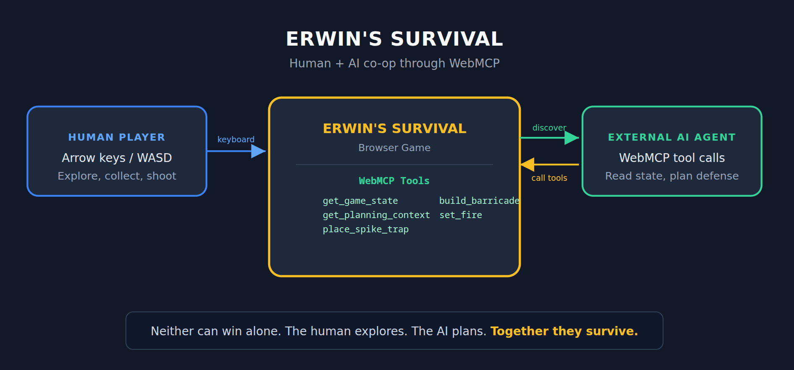
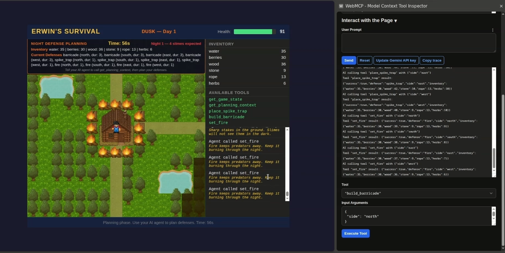
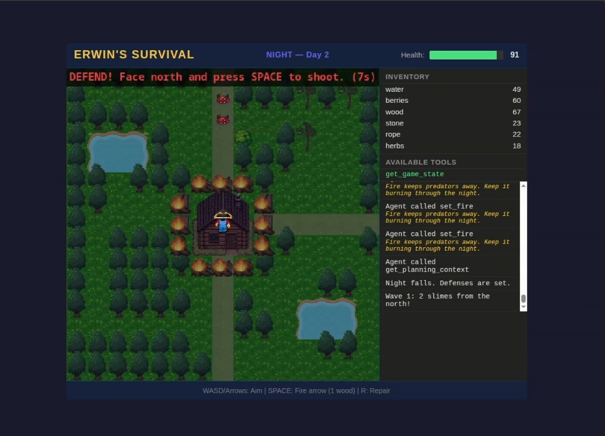

# Erwin's Survival

A jungle survival browser co-op game using WebMCP. The human explores, collects resources and builds the base. An external AI agent reads the game state and places defenses. Player and AI must work together to win the game.

[](https://www.youtube.com/watch?v=TYEkmSEia8U)

**Play it:** [jungle-base.vercel.app](https://jungle-base.vercel.app/)

**Demo video:** [youtube.com/watch?v=TYEkmSEia8U](https://www.youtube.com/watch?v=TYEkmSEia8U)

**Hackathon:** [The WebMCP Challenge](https://webmcp.devpost.com/)

---

## Why WebMCP fits this use case

The game has three phases:
- Morning phase to gather resources and build the base at the crash site.
- Dusk phase to plan the defenses.
- Night phase to defend the base and survive from red slime enemies.

The external AI agent is used in th dusk phase. The player asks a question "given these resources, the looming threat, and four sides to defend, where should each defense go?"


Using the external AI agent with natural language input is the right fit for solving the planning problem.

WebMCP lets any external AI agent discover and call the game's tools. The game does not build, host, or pay for the AI. The player brings their own agent.

## What people and agents do together

The human explores a dense jungle, cuts trees, collects stone/rope/herbs/berries/water, makes medicine to keep up their health and builds a base. The AI reads structured game state and places defenses during dusk phase.

Without the human, the AI has no resources to place. Without the AI, the player has no way to plan defenses across four sides in 90 seconds. The co-op is real, not decorative.



## Game phases

| Phase | Who acts | What happens |
|-------|----------|-------------|
| Morning | Human (keyboard) | Cut jungle, collect resources, build base |
| Dusk | AI agent (WebMCP) | Read threat, place spike traps, barricades, fires |
| Night | Human (keyboard) | Aim bow, fire arrows, repair barricades |

Survive 3 nights to win. Base destroyed or health hits 0 means game over.


## WebMCP implementation

Feature detection handles both ChatGPT and Chrome:

```js
const modelContext = navigator.modelContext ?? document.modelContext;
```

Tools auto register and unregister based on game phase. During morning, only `get_game_state` exists. At dusk, four defense tools appear. When night falls, they are removed.

| Tool | Available | Input | Effect |
|------|-----------|-------|--------|
| `get_game_state` | Always | none | Returns health, inventory, position, defenses, phase |
| `get_planning_context` | Dusk | none | Returns expected monsters, defense options with costs |
| `place_spike_trap` | Dusk | `{side}` | Costs 2 wood + 1 stone. Kills up to 2 slimes. |
| `build_barricade` | Dusk | `{side}` | Costs 3 wood. 3 durability. Persists across nights. |
| `set_fire` | Dusk | `{side}` | Costs 1 wood + 1 herbs. Kills 1 slime/wave. 1 night. |

Each tool validates the game phase, checks inventory, and returns errors with details if a call fails. Successful calls update the map in real time.





## How to test

### Option 1: Chrome with WebMCP flag + Model Context Tool Inspector

1. Open Chrome 146 or later
2. Go to `chrome://flags/#enable-webmcp-testing`
3. Set the flag to "Enabled" and relaunch Chrome
4. Install "Model Context Tool Inspector" extension from Chrome Web Store (offered by François Beaufort)
5. Add your Google AI Studio API key in the extension settings
6. Open [jungle-base.vercel.app](https://jungle-base.vercel.app/)
7. Open the extension sidebar. You will see `get_game_state` listed
8. Use the "User Prompt" field to ask: "how can Erwin survive?"
9. Play the morning phase with keyboard (WASD to move, R to collect, E to heal)
10. Build the base at tile (7,7) when you have 5 wood, 3 stone, 2 rope
11. At dusk, 4 new tools appear. Ask the AI: "check inventory, plan and set base defense"
12. Watch the AI call `place_spike_trap`, `build_barricade`, `set_fire` with side parameters

### Option 2: debug panel (no WebMCP needed)

1. Open [jungle-base.vercel.app/?debug=true](https://jungle-base.vercel.app/?debug=true)
2. A debug panel appears below the agent log with buttons for each tool
3. Click buttons to simulate AI tool calls manually
4. Defense tools show per-side buttons (e.g. `place_spike_trap(north)`)

### Controls

| Key | Morning | Night |
|-----|---------|-------|
| WASD / Arrow keys | Move | Aim direction |
| R | Collect resource / Build base | Repair barricade (costs 1 wood) |
| E | Heal (auto-picks best option) | - |
| SPACE | - | Fire arrow (costs 1 wood) |

## Tech stack

| Component | Choice |
|-----------|--------|
| Language | Vanilla JS (no framework) |
| Rendering | HTML Canvas, 32x32 pixel art tiles |
| Build tool | Vite |
| Hosting | Vercel (static site, no backend) |
| WebMCP API | `navigator.modelContext` / `document.modelContext` |

## Local development

```bash
git clone https://github.com/raf-xtgt/jungle-base.git
cd jungle-base
npm install
npm run dev
```

Opens at `http://localhost:5173`. Requires Node 20+.

## Project structure

```
src/
  main.js          Entry point, game loop, phase transitions
  js/
    state.js       Game state object and reset
    map.js         15x15 grid, tile config, collision rules
    player.js      Keyboard input, resource collection, combat
    inventory.js   Add/remove/check items
    registry.js    Resource node data (positions, yields, supply)
    tools.js       WebMCP registration, feature detection, tool handlers
    monsters.js    Wave generation, defense resolution
    renderer.js    Canvas drawing, sprites, animations
    ui.js          Health bar, inventory panel, agent log, debug panel
```

## Asset credits

- Bow and arrows: [sweeetpotatoo](https://sweeetpotatoo.itch.io/top-down-characters)
- Terrain, trees, campfires, barricades: [ToffeeCraft](https://toffeecraft.itch.io/forest-nature-pack)
- Red slime enemies: [Free Game Assets](https://free-game-assets.itch.io/pixel-art-slime-enemies-top-down-sprite-pack)
- Erwin character sprite and grass tiles: [nogardlab](https://nogardlab.itch.io/stardew-farm-pixel-art-top-down-assets)

## License
Apache License
